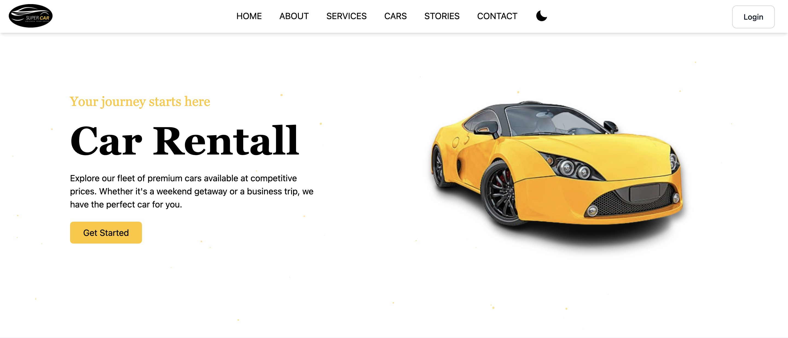
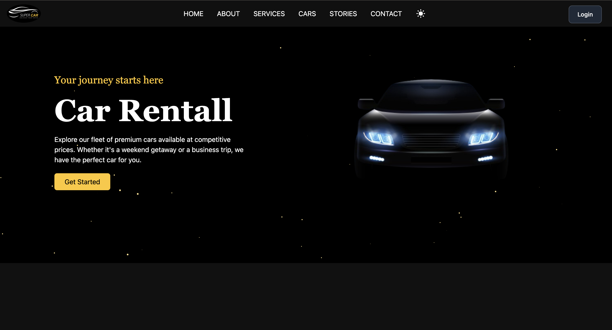
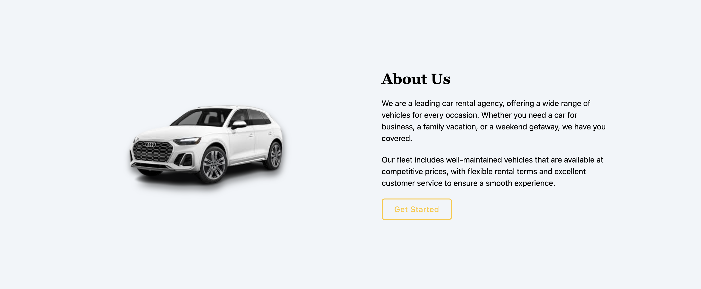
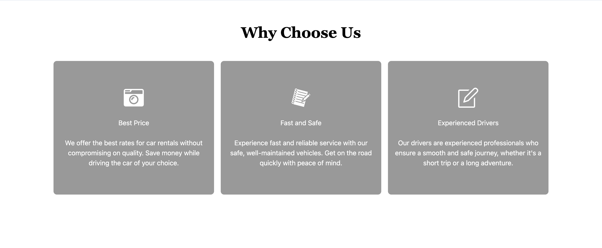
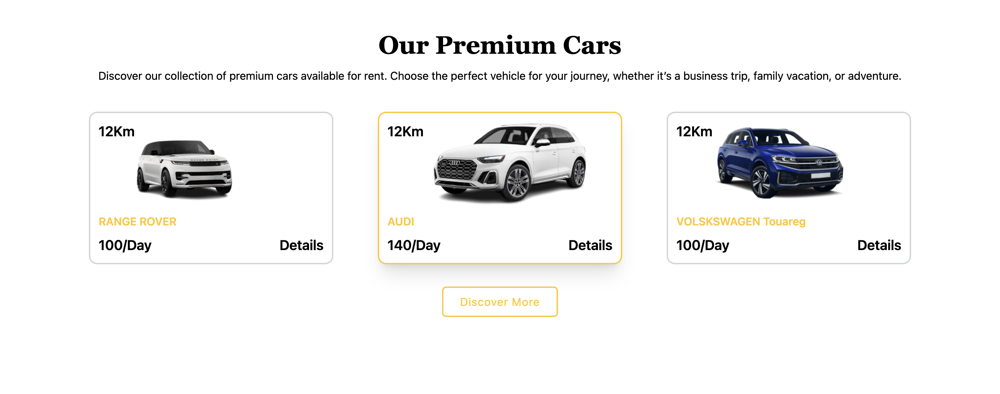
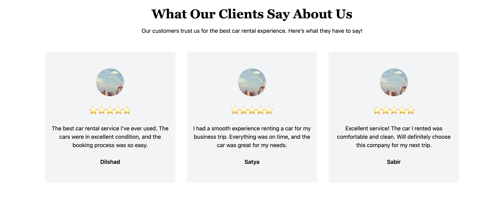
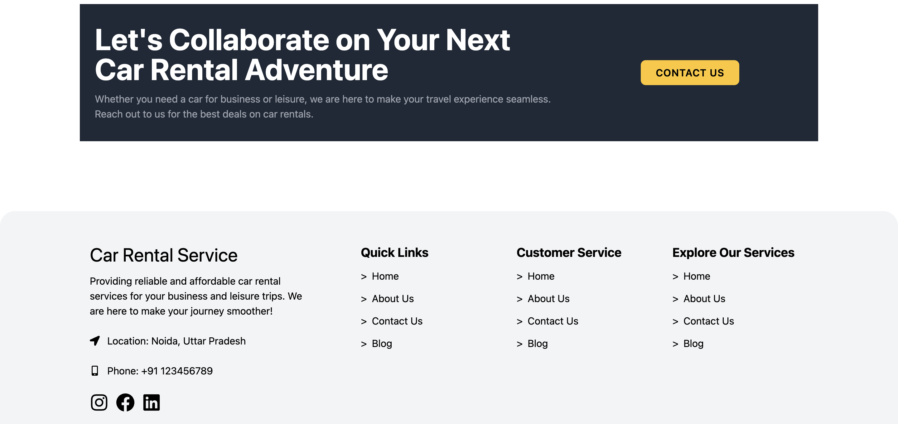

# Application Web de Gestion de Location de Voitures

## Description du Projet

Ce projet consiste en la conception et la réalisation d'une application web pour la gestion d'une agence de location de voitures. L'objectif est de faciliter la gestion des locations de véhicules, des réservations et des clients, tout en offrant une expérience utilisateur fluide. L'application est composée de deux interfaces principales : une pour les **clients** et une pour les **administrateurs**.

## Fonctionnalités Principales

### Côté Client :
- Inscription, connexion, et récupération de mot de passe
- Consultation des véhicules disponibles
- Réservation de véhicules
- Système de paiement sécurisé via PayPal
- Réception de la facture et du contrat de réservation par email
- Avis et commentaires sur les véhicules
- Mode sombre et clair pour l'interface avec un design intuitif

### Côté Administrateur :
- Gestion des véhicules (ajout, modification, suppression)
- Gestion des réservations et des clients
- Consultation des statistiques (réservations, revenus, etc.)
- Gestion des paiements et des avis des clients
- Une dashboard administrateur pour analyser l'état actuel ainsi que les prévisions futures

## Architecture du Système

### Backend
Le backend est développé avec **Spring Boot** et est responsable de la logique métier et de la gestion des données :
- **Controller** : Gère les requêtes entrantes et fait le lien avec la logique métier.
- **DTO** (Data Transfer Object) : Facilite la communication entre le frontend et le backend, et joue également le rôle d'une couche de sécurité.
- **Service** : Contient la logique métier principale.
- **Security** : Utilisation de **JWT** pour sécuriser les API et gérer l'authentification.

### Frontend
Le frontend est développé avec **React** et **Tailwind CSS** :
- **Composants React** : Permettent de construire une interface utilisateur dynamique et réactive.
- **React Router** : Gère la navigation entre les différentes pages de l'application.
- **Axios** : Pour effectuer des requêtes HTTP vers le backend.

## Technologies Utilisées
- **Frontend** : React, Tailwind CSS
- **Backend** : Spring Boot, Spring Security, JWT
- **Base de données** : MySQL
- **Tests** : Postman
- **Gestion de projet** : Jira
- **Contrôle de version** : GitHub

## Pages Principales
Voici une description des principales pages de l'application :

### Côté Client

1. **Page d'accueil** : Présente une vue dynamique des véhicules disponibles.
   - 
   
    
   
   - 
   
    
   
   - 
   
    
   
   - 
   
    
   
   - 
   
    
   
   - 
   
    
   
   - 

2. **Page de connexion** : Permet de se connecter, de réserver ou de créer un compte.
   - 
   
    
   
   - 
   
    
   
   - 
   
    
   
   - 

3. **Page des véhicules** : Affiche la liste des véhicules avec des options de filtre.
   - 
   
    
   
   - 

4. **Page de réservation** : Permet aux utilisateurs de réserver un véhicule.
    - 

5. **Page de paiement** : Système sécurisé de paiement via PayPal.
    - 
    
     
    
    - 

6. **Facture et Contrat** : Envoi par email du contrat et de la facture après réservation.
    - 
    
     
    
    - 

7. **Page d'avis** : Permet aux utilisateurs de donner leur avis sur les véhicules.
    - 

### Côté Administrateur

1. **Page de gestion des véhicules** : Ajout, modification et suppression des véhicules.
    - 
    
     
    
    - 
    
     
    
    - 
    
     
    
    - 

2. **Page de gestion des réservations** : Visualisation et gestion des réservations des clients.
   - 

3. **Page de gestion des clients** : Visualisation et gestion des clients avec des options.
   - 

4. **Page de statistiques** : Statistiques de l'activité de l'agence de location.
   - 
